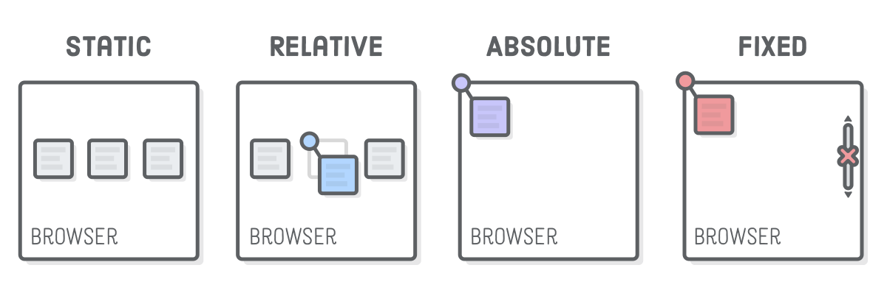
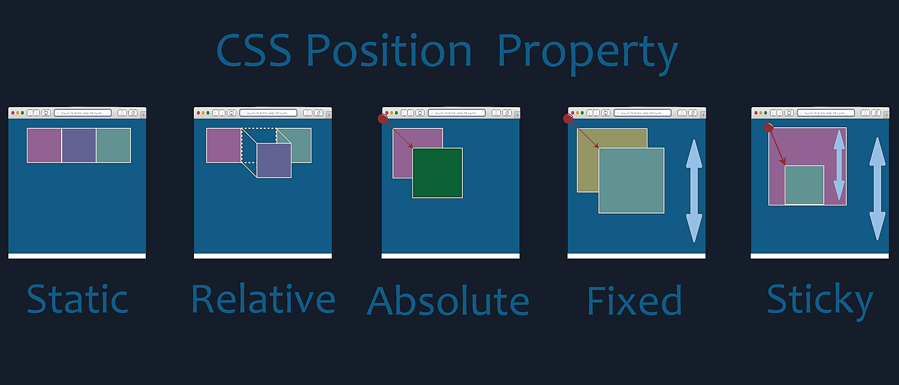

## Day- 7 Positioning & Responsive Design
## ✅ 1️⃣ CSS Position Property
The position property controls how elements are placed on the page.

# There are 4 main values:

# 🔹 1. position: static (Default)

## ✔️ Default value

-Elements follow normal document flow
-top, left, right, bottom DO NOT work
css :
.box {
  position: static;
}
-👉 Used normally when you don’t need special positioning.

# 🔹 2. position: relative

## ✔️ Moves element relative to its original position

-Original space is still reserved
-top, left, right, bottom work
CSS:
.box {
  position: relative;
  top: 20px;
  left: 30px;
}
-👉 Element shifts from its original place.

## 🔹 3. position: absolute

## ✔️ Positioned relative to nearest positioned parent
(Parent must have relative, absolute, or fixed)
CSS:
.parent {
  position: relative;
}

.child {
  position: absolute;
  top: 10px;
  right: 10px;
}

-👉 Removes element from normal flow.

# 🔥 Very important for:
-Badges
-Dropdowns
-Tooltips
-Icons inside cards

## 🔹 4. position: fixed

