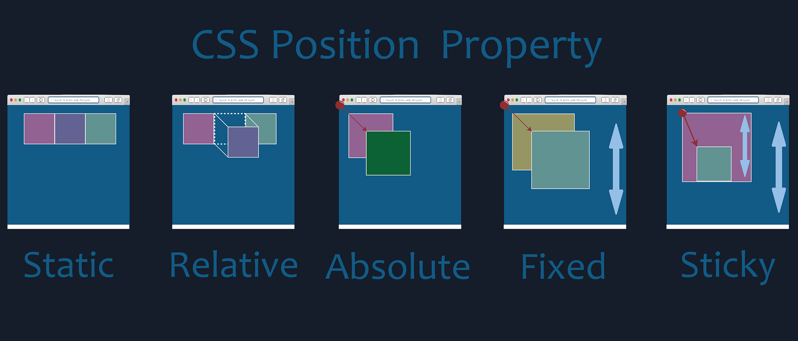

## Day- 7 Positioning & Responsive Design
## ✅ 1️⃣ CSS Position Property
The position property controls how elements are placed on the page.

# There are 4 main values:
# 🔹 1. position: static (Default)

